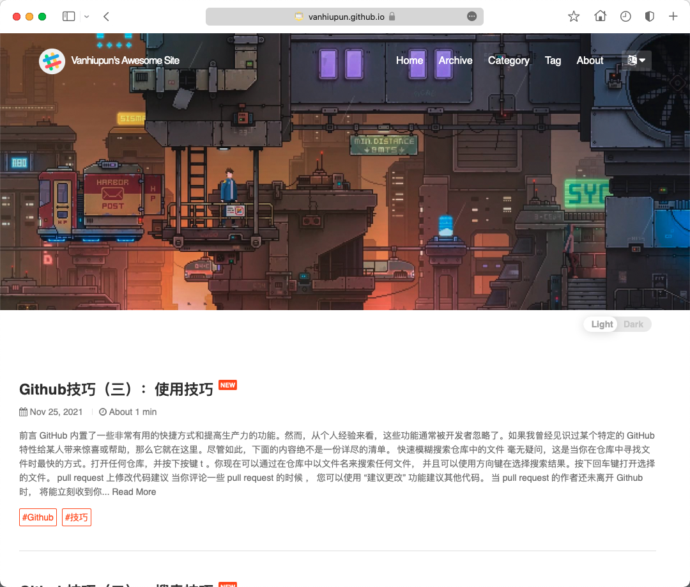

<div align="center">

<p></p>

<h3 align="center">
  <a href="https://jekyllrb.com/" target="_blank"><code>Jekyll</code></a> theme for elegant writers.
</h3>


<a href="https://github.com/vanhiupun/Vanhiupun.github.io/actions/workflows/jekyll.yml" target="_blank">
    
</a>

<a href="https://circleci.com/gh/vanhiupun/Vanhiupun.github.io/tree/circleci-project-setup" target="_blank">
  
</a> 
 
<a href="https://github.com/vanhiupun/Vanhiupun.github.io" target="_blank">
  
</a>
  
<a href="https://rubygems.org/gems/jekyll-theme-yat" target="_blank">
    
</a> 

<a href="https://github.com/vanhiupun" target="_blank">
    
</a> 
      
<a href="https://vanhiupun.github.io" target="_blank">
    
</a> 
      
<a href="mailto:fanxiaobin422@gmail.com" target="_blank">
    
</a> 
      
<a href="https://github.com/vanhiupun/Vanhiupun.github.io/blob/c0c037532393ee2718892f87b200a0bbe33e7eb9/License" target="_blank">
    
</a>
      
<a href="http://jekyllthemes.org/" target="_blank">
    
</a> 

<a href="https://github.com/jeffreytse/jekyll-theme-yat" target="_blank">
    
</a> 
</div>

<div align="center">
  <sub><a href="https://vanhiupun.github.io/jekyll/2021/11/20/制作和我一样的Jekyll博客.html" target="_blank"> Build a Jekyll blog </a>❤︎
  </sub>｜
  <sub><a href="https://vanhiupun.github.io/" target="_blank">Demo site</a>
  </sub>｜<sub><a href="/readme_CN.md" target="_blank">中文文档</a>
  </sub>
</div>

#### Install

```git
git clone git@github.com:vanhiupun/Vanhiupun.github.io.git
```
#### Setting up the environment
1. You will need [Ruby](https://www.ruby-lang.org/zh_cn/) and [Bundler](https://bundler.io/) to use [Jekyll](https://www.jekyll.com.cn). Follow the use of [Jekyll and Bundler](https://jekyllrb.com/tutorials/using-jekyll-with-bundler/) to meet environmental requirements.
​
2. To set up your environment to develop this theme, please run `bundle install` .
​
3. To test your theme, please run `bundle exec jekyll serve` and open your browser [ http://localhost:4000](http://localhost:4000)
   
This will start the Jekyll server with your theme.

Test your subject content by adding pages, documents, data, etc. as usual. When you make changes to the theme and content, your site will be regenerated, and you should see the changes in your browser after refreshing

When your theme is released, only the files `_data` , `_layouts` , `_includes` , `_sass` and `assets` using Git tracking will be bundled together.

To add a custom catalog to your theme gems, edit the regular expression `jekyll-theme-yat.gemspec` accordingly .

#### Start

You can modify the `_config.yml` file in general to easily start building your own blog:

```bash
title: Vanhiupun blog # Your blog site title

email: fanxiaobin422@gamil.com # Your email

author: Vanhiupun # Your name

baseurl: "" # The sub-path of the website, eg /blog

url: "" # The base host name and protocol of the site, eg http://example.com

favicon: "/favicon.png" # Use absolute path for website icon eg /favicon.png, not recommended./favicon.png

# Paging settings
paginate: 5 #Display 5 articles on the homepage

# Extract size setting
excerpt_size: 250 #The word count of the homepage article is displayed as 250 words

```

#### Write a blog post

Posts to be published are generally placed here in Markdown format `_posts/` , you only need to look at the posts in this template and you will immediately understand how to set them.

```bash
---
layout: post #Layout
title: Scientific Internet Guide (2): Line Differences and Choices #Title
categories: Science on the Internet#Categories
banner:
  image: https://vanhiupun.github.io/assets/images/banners/jichang.jpeg #The image address can also be used./assets/images/banners/jichang.jpeg
  opacity: 0.618 #opacity
  background: "#000" #Background color
  height: "50vh" #height
  min_height: "50vh" #Width
  heading_style: "font-size: 4.25em; font-weight: bold; "#heading style
  subheading_style: "color: gold" #Subheading style
tags: [Airport Guide] #tag
---
```

#### Header Image

You can choose the base map of the title of each page of the blog. Just look at a few sample posts and you will know how to set it.

The choice of the title base map is entirely based on personal aesthetics. Each article can have a different base map, you can put whatever you want, the final width should be enough, the size should not be too big, otherwise the loading will be slow.

> The uploaded pictures are best compressed first. ImageOptim image compression software is recommended here to make your blog take off.

But it should be noted that the title of this template is **white** , so the background color should be set to **gray** or **black** . In short, the dark color is right. Of course, you can also customize and modify the font color. In short, using github pages is to completely customize your own blog.

#### Customization

If you like toss, you can customize the code of this template.

**If you can understand `_include /` and `_layouts /` Code folder (this is where the entire interface layout), you can use `Jekyll` use template engine ` Liquid` syntax directly modify / add Code, let's make a more creative custom interface!**
​

#### Disqus comments

It’s more popular internationally, and the interface is very elegant and concise. If someone comments, you can notify you in real time. Just reply to the notification email.
You need to register for a [Disqus account](https://disqus.com/) . Just replace my account with yours

```bash
# Disqus comments
disqus:
  shortname: "vanhiupun" #Register an account in disqus and change this to your own account
```

#### Analytics

Website analysis, now supports [Google Analytics](https://analytics.google.com/analytics/web/) . You need to go to the official website to register, and then paste the returned code below:

```bash
# Google Analytics
google_analytics: "UA-212989441-1" # If you register one with your Google account, you will be given an id like this, just replace this
```

## contribute
If you are interested in this project, you can contribute in any of the following areas:

- Star this project
- You can [open an issue](https://github.com/vanhiupun/Vanhiupun.github.io/issues/new), if you want to solve the problem, we will start from there.
- Use tests, report errors, or send requests or requests.
- If your English is very good, please help me write the document.

## Thanks

This template is Fork from [jeffreytse](https://github.com/jeffreytse/jekyll-theme-yat) , thanks to the author :+1:

## License

Follow the MIT license. For details, please refer to [LICENSE](./License) .

## Sponsor


## related resources

[Demo Site](https://vanhiupun.github.io)

[Build Jekyll Blog](https://vanhiupun.github.io/jekyll/2021/11/20/制作和我一样的Jekyll博客.html)

[Jekyll detailed construction process](https://vanhiupun.github.io/jekyll/2021/11/16/一步一步创建Jekyll主题.html)
